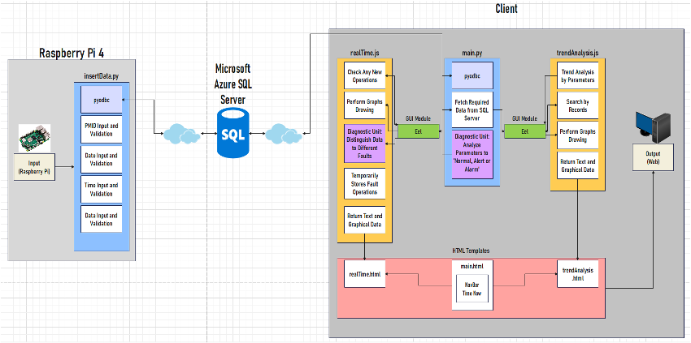
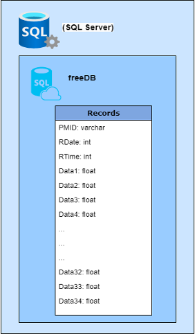

# Undergrad Final Year Project: IoT Maintenance on Railway Point Machine

Real-time maintenance system based on MCSA algorithm for predictive maintenance on railway point machines proposed.
It is a practical solutions to real-world railway problems, benefiting railway duty operators and maintainers on railway point machines. <br/>
This is the **Raspberry Pi side** of this project.


<br/>System Architecture of the complete system.

## Prerequisites

Before running this project, please ensure that you have the following:

1. Python installed on your system.
2. An active cloud ODBC SQL Server with the necessary database and credentials.

This project relies on a cloud ODBC SQL Server for real-time update. To successfully run and use this project, make sure you have access to a valid ODBC SQL Server instance.

If you don't have an ODBC SQL Server, you can download and install the [ODBC Driver for SQL Server](https://learn.microsoft.com/en-us/sql/connect/odbc/download-odbc-driver-for-sql-server?view=sql-server-ver16).

**Caution: ODBC driver does not support 32-bit Raspberry Pi OS**

After downloading the driver, run the following script.
```bash
  pip install pyodbc
```


<br/>Example database structure

## Demo
[Video demo](https://jerryyip.net/#project-IoT-Railway) on my personal website.

## Run Locally

Clone the project

```bash
  git clone https://github.com/yhmyhm0910/UG_FinalYearProject-RaspberryPi
```

Go to the project directory

```bash
  cd UG_FinalYearProject-RaspberryPi
```

Run the script

```bash
  python3 insertData.py
```
